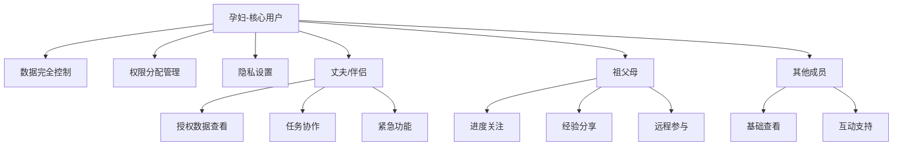
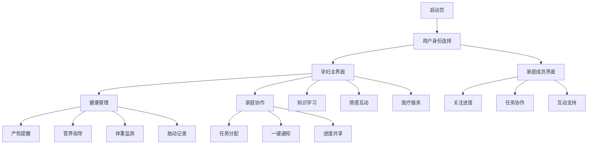
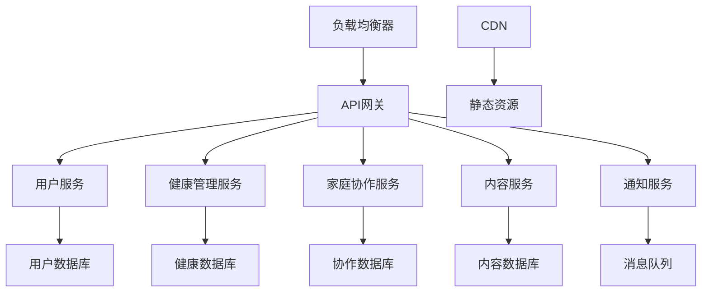
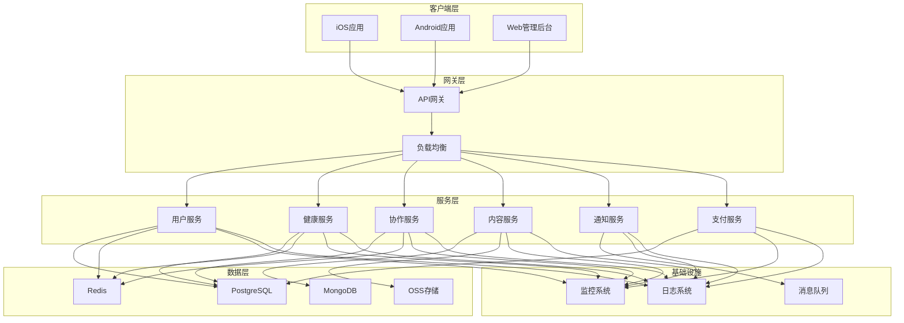
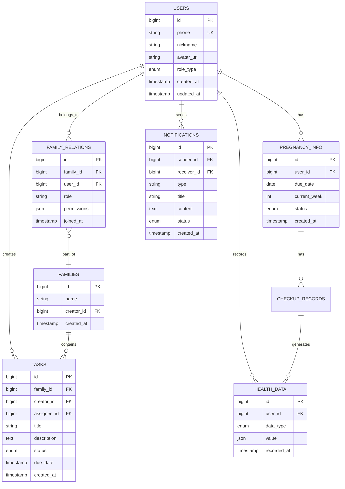

# 孕期家庭协作移动应用 - 产品设计方案

## 项目概述

**产品名称**: 孕期家庭协作应用（暂定名：家有孕宝）
**目标市场**: 中国大陆
**开发平台**: iOS + Android 双平台
**核心理念**: 以孕妇为中心的个人健康管理，家庭成员协作支持
**商业模式**: 免费基础功能 + 高级会员订阅

## 1. 市场调研和竞品分析

### 1.1 市场现状
- **市场规模**: 中国每年新生儿约1000万，孕期用户群体庞大
- **用户痛点**: 
  - 孕期信息分散，缺乏系统性管理
  - 家庭成员参与度不高，沟通不畅
  - 医疗资源获取困难
  - 缺乏专业指导和个性化建议

### 1.2 主要竞品分析

#### 美柚（孕期版）
- **优势**: 用户基数大，内容丰富
- **劣势**: 主要面向个人用户，家庭协作功能薄弱
- **差异化机会**: 强化家庭多角色协作

#### 宝宝树孕育
- **优势**: 社区活跃，知识体系完善
- **劣势**: 功能复杂，用户体验有待优化
- **差异化机会**: 简化操作流程，突出协作特色

#### 孕期伴侣
- **优势**: 功能专业，医疗资源丰富
- **劣势**: 缺乏家庭成员参与机制
- **差异化机会**: 创新的家庭协作模式

### 1.3 市场机会
- **蓝海领域**: 真正的家庭多角色协作孕期管理
- **技术趋势**: AI个性化推荐、智能健康监测
- **政策支持**: 三胎政策推动母婴市场发展

## 2. 用户角色和权限体系设计

### 2.1 核心用户角色

#### 主要角色：孕妇（核心用户）
**权限级别**: 最高权限
**核心功能**:
- 个人健康数据录入和管理
- 医疗记录完整访问
- 家庭成员邀请和权限分配
- 一键通知功能（重点功能）
- 个性化提醒设置
- 隐私设置控制

#### 重要角色：丈夫/伴侣
**权限级别**: 高级权限
**核心功能**:
- 查看孕妇健康数据（经授权）
- 任务认领和完成
- 紧急联系和协助
- 情感支持记录
- 陪同提醒设置

#### 支持角色：祖父母
**权限级别**: 中级权限
**核心功能**:
- 查看孕期进度概览
- 经验分享和建议
- 提醒辅助功能
- 远程关怀表达
- 有限的健康数据查看

#### 扩展角色：其他家庭成员
**权限级别**: 基础权限
**核心功能**:
- 查看基本孕期信息
- 祝福和鼓励互动
- 协助支持任务
- 成就分享查看

### 2.2 权限管理机制



## 3. 核心功能模块详细设计

### 3.1 孕期健康管理模块

#### 3.1.1 产检提醒系统
**功能特点**:
- 智能提醒算法，根据孕周自动生成
- 一键通知家庭成员功能（核心特色）
- 医院路线规划和时间安排
- 产检结果记录和分析

**用户交互流程**:
1. 系统根据孕周推送产检提醒
2. 孕妇确认产检时间
3. 一键通知相关家庭成员
4. 家庭成员响应和任务认领
5. 产检完成后结果录入和分享

#### 3.1.2 营养指导系统
**功能特点**:
- 个性化营养方案推荐
- 每日营养摄入记录
- 家庭成员协助监督
- 营养知识科普

#### 3.1.3 体重监测
**功能特点**:
- 体重趋势图表分析
- 异常预警机制
- 家庭成员关注提醒
- 专业建议推送

#### 3.1.4 胎动记录
**功能特点**:
- 简单易用的胎动计数器
- 胎动模式分析
- 异常情况自动提醒
- 与家庭成员分享胎动喜悦

### 3.2 家庭协作中心

#### 3.2.1 任务分配系统
**核心功能**:
- 孕期相关任务创建和分配
- 任务进度实时同步
- 完成情况统计和奖励
- 任务模板库（购物清单、准备用品等）

**任务类型**:
- 日常照料任务
- 医疗陪同任务
- 物品准备任务
- 学习分享任务

#### 3.2.2 一键通知系统（核心特色功能）
**功能设计**:
- 快速通知模板（产检、不适、紧急等）
- 自定义通知内容
- 多渠道推送（应用内、短信、电话）
- 响应状态实时反馈

**通知场景**:
- 产检提醒
- 身体不适
- 紧急情况
- 重要时刻分享
- 需要协助

#### 3.2.3 进度共享
**功能特点**:
- 孕期进度可视化展示
- 重要里程碑记录
- 家庭成员互动评论
- 成长记录时间轴

### 3.3 知识教育体系

#### 3.3.1 分阶段孕期知识
**内容结构**:
- 备孕期指导
- 孕早期（1-12周）
- 孕中期（13-28周）
- 孕晚期（29-40周）
- 产后恢复

**知识形式**:
- 图文并茂的科普文章
- 短视频教程
- 专家直播讲座
- 互动问答

#### 3.3.2 育儿指南
**内容覆盖**:
- 新生儿护理
- 婴幼儿发育
- 早期教育
- 安全防护

#### 3.3.3 专家建议系统
**功能设计**:
- AI智能问答（免费）
- 专家在线咨询（会员功能）
- 个性化建议推送
- 专业医生预约

### 3.4 情感互动空间

#### 3.4.1 心情记录
**功能特点**:
- 情绪日记记录
- 心情趋势分析
- 家庭成员关怀提醒
- 情感支持建议

#### 3.4.2 家庭相册
**功能设计**:
- 孕期照片记录
- 成长时间轴
- 家庭成员共同维护
- 隐私权限控制

#### 3.4.3 祝福留言系统
**互动功能**:
- 家庭成员留言板
- 特殊日期祝福提醒
- 语音留言支持
- 表情包和贴纸

#### 3.4.4 成就分享
**激励机制**:
- 孕期里程碑成就
- 家庭协作成就
- 知识学习成就
- 社交分享功能

### 3.5 医疗资源整合

#### 3.5.1 医院推荐系统
**功能特点**:
- 基于地理位置的医院推荐
- 医院评价和口碑
- 科室专业度评估
- 费用参考信息

#### 3.5.2 医生预约
**服务内容**:
- 在线预约挂号
- 专家号源推荐
- 预约提醒服务
- 就诊记录管理

#### 3.5.3 紧急联系
**安全保障**:
- 一键紧急呼叫
- 家庭成员自动通知
- 医疗急救信息
- GPS定位共享

## 4. 用户交互流程和界面架构

### 4.1 应用整体架构



### 4.2 核心交互流程

#### 4.2.1 一键通知流程
1. **触发场景**: 孕妇需要通知家庭成员
2. **操作步骤**:
   - 点击"一键通知"按钮
   - 选择通知类型（产检/不适/紧急/分享）
   - 选择通知对象（可多选）
   - 添加详细信息（可选）
   - 发送通知
3. **家庭成员响应**:
   - 接收多渠道通知
   - 查看详细信息
   - 响应状态反馈
   - 执行相关任务

#### 4.2.2 任务协作流程
1. **任务创建**: 孕妇或系统自动创建任务
2. **任务分配**: 指定或开放认领
3. **任务执行**: 家庭成员完成任务
4. **进度反馈**: 实时更新任务状态
5. **完成确认**: 任务完成和评价

### 4.3 界面设计原则

#### 4.3.1 孕妇界面设计
- **简洁明了**: 减少认知负担
- **一键操作**: 核心功能快速访问
- **温馨色调**: 粉色、浅蓝等柔和色彩
- **大字体**: 适合孕期视觉疲劳

#### 4.3.2 家庭成员界面
- **信息聚焦**: 突出孕妇相关信息
- **任务导向**: 清晰的任务列表和状态
- **互动友好**: 便于表达关爱和支持
- **权限明确**: 根据角色显示相应功能

## 5. 数据库设计和API架构

### 5.1 核心数据模型

#### 5.1.1 用户相关表
```sql
-- 用户基础信息表
CREATE TABLE users (
    id BIGINT PRIMARY KEY,
    phone VARCHAR(20) UNIQUE,
    nickname VARCHAR(50),
    avatar_url VARCHAR(200),
    role_type ENUM('pregnant', 'partner', 'grandparent', 'family'),
    created_at TIMESTAMP,
    updated_at TIMESTAMP
);

-- 家庭关系表
CREATE TABLE family_relations (
    id BIGINT PRIMARY KEY,
    family_id BIGINT,
    user_id BIGINT,
    role VARCHAR(20),
    permissions JSON,
    invited_by BIGINT,
    joined_at TIMESTAMP
);

-- 孕期信息表
CREATE TABLE pregnancy_info (
    id BIGINT PRIMARY KEY,
    user_id BIGINT,
    due_date DATE,
    current_week INT,
    pregnancy_status ENUM('preparing', 'pregnant', 'postpartum'),
    created_at TIMESTAMP
);
```

#### 5.1.2 健康管理相关表
```sql
-- 产检记录表
CREATE TABLE checkup_records (
    id BIGINT PRIMARY KEY,
    user_id BIGINT,
    checkup_date DATE,
    hospital VARCHAR(100),
    doctor VARCHAR(50),
    results JSON,
    attachments JSON,
    created_at TIMESTAMP
);

-- 健康数据表
CREATE TABLE health_data (
    id BIGINT PRIMARY KEY,
    user_id BIGINT,
    data_type ENUM('weight', 'blood_pressure', 'fetal_movement'),
    value JSON,
    recorded_at TIMESTAMP
);
```

#### 5.1.3 协作相关表
```sql
-- 任务表
CREATE TABLE tasks (
    id BIGINT PRIMARY KEY,
    family_id BIGINT,
    creator_id BIGINT,
    assignee_id BIGINT,
    title VARCHAR(200),
    description TEXT,
    status ENUM('pending', 'in_progress', 'completed'),
    due_date TIMESTAMP,
    created_at TIMESTAMP
);

-- 通知记录表
CREATE TABLE notifications (
    id BIGINT PRIMARY KEY,
    sender_id BIGINT,
    receiver_id BIGINT,
    type VARCHAR(50),
    title VARCHAR(200),
    content TEXT,
    status ENUM('sent', 'read', 'responded'),
    created_at TIMESTAMP
);
```

### 5.2 API架构设计

#### 5.2.1 RESTful API 设计
```
# 用户认证
POST /api/auth/login
POST /api/auth/register
POST /api/auth/logout

# 用户管理
GET /api/users/profile
PUT /api/users/profile
POST /api/users/invite-family

# 健康管理
GET /api/health/checkups
POST /api/health/checkups
GET /api/health/data/{type}
POST /api/health/data

# 家庭协作
GET /api/family/tasks
POST /api/family/tasks
PUT /api/family/tasks/{id}
POST /api/family/notifications

# 知识内容
GET /api/content/articles
GET /api/content/videos
POST /api/content/favorites
```

#### 5.2.2 实时通信设计
- **WebSocket连接**: 实现实时通知推送
- **消息队列**: 处理高并发通知场景
- **推送服务**: 集成极光推送等第三方服务

### 5.3 数据同步策略
- **增量同步**: 减少数据传输量
- **离线缓存**: 支持网络不稳定场景
- **冲突解决**: 多用户数据修改冲突处理

## 6. 数据安全和隐私保护方案

### 6.1 数据安全措施

#### 6.1.1 传输安全
- **HTTPS加密**: 所有API通信使用SSL/TLS
- **证书绑定**: 防止中间人攻击
- **API签名**: 请求参数签名验证

#### 6.1.2 存储安全
- **数据加密**: 敏感数据AES-256加密存储
- **密钥管理**: 使用HSM或云密钥管理服务
- **数据备份**: 定期加密备份，异地存储

#### 6.1.3 访问控制
- **JWT认证**: 无状态身份验证
- **权限控制**: 基于角色的访问控制(RBAC)
- **API限流**: 防止恶意请求和DDoS攻击

### 6.2 隐私保护机制

#### 6.2.1 数据最小化原则
- **按需收集**: 只收集必要的用户数据
- **用途限制**: 数据仅用于声明的目的
- **定期清理**: 自动删除过期和无用数据

#### 6.2.2 用户控制权
- **隐私设置**: 用户可控制数据分享范围
- **数据导出**: 支持用户数据导出功能
- **删除权利**: 用户可要求删除个人数据

#### 6.2.3 合规要求
- **《网络安全法》**: 遵守中国网络安全法规
- **《个人信息保护法》**: 符合个人信息保护要求
- **医疗数据规范**: 遵守医疗健康数据相关规定

### 6.3 安全监控和应急响应
- **安全日志**: 记录所有安全相关事件
- **异常检测**: 自动识别异常访问行为
- **应急预案**: 数据泄露应急响应流程

## 7. 技术栈选择和开发架构

### 7.1 移动端技术栈

#### 7.1.1 跨平台方案选择
**推荐方案**: Flutter
**选择理由**:
- 单一代码库支持iOS和Android
- 性能接近原生应用
- Google支持，生态完善
- 适合快速迭代开发

**备选方案**: React Native
- Facebook支持，社区活跃
- 代码复用率高
- 第三方库丰富

#### 7.1.2 移动端架构设计
```
lib/
├── main.dart                 # 应用入口
├── app/                      # 应用配置
├── core/                     # 核心功能
│   ├── network/             # 网络请求
│   ├── storage/             # 本地存储
│   ├── utils/               # 工具类
│   └── constants/           # 常量定义
├── features/                # 功能模块
│   ├── auth/               # 认证模块
│   ├── health/             # 健康管理
│   ├── family/             # 家庭协作
│   ├── knowledge/          # 知识学习
│   └── interaction/        # 情感互动
├── shared/                  # 共享组件
│   ├── widgets/            # 通用组件
│   ├── models/             # 数据模型
│   └── services/           # 服务类
└── resources/              # 资源文件
    ├── images/
    ├── fonts/
    └── translations/
```

### 7.2 后端技术栈

#### 7.2.1 技术选择
**应用服务器**: Node.js + Express.js
- 高并发处理能力
- JavaScript全栈开发
- 丰富的NPM生态

**数据库**: 
- **主数据库**: PostgreSQL（关系型数据，ACID特性）
- **缓存数据库**: Redis（会话存储，缓存）
- **文档数据库**: MongoDB（非结构化数据）

**消息队列**: RabbitMQ
- 可靠的消息传递
- 支持多种消息模式
- 集群部署支持

#### 7.2.2 微服务架构设计


### 7.3 云服务和部署

#### 7.3.1 云平台选择
**推荐**: 阿里云
- 国内访问速度快
- 完善的云服务生态
- 符合国内合规要求

**服务组件**:
- **ECS**: 应用服务器
- **RDS**: 数据库服务
- **OSS**: 对象存储
- **CDN**: 内容分发
- **SLB**: 负载均衡

#### 7.3.2 DevOps流程
- **版本控制**: Git + GitLab
- **CI/CD**: GitLab CI/CD
- **容器化**: Docker + Kubernetes
- **监控**: Prometheus + Grafana
- **日志**: ELK Stack

## 8. 商业化功能设计

### 8.1 免费功能（基础版）

#### 8.1.1 核心免费功能
- 基础健康数据记录
- 家庭成员邀请（最多5人）
- 基础任务协作
- 一键通知功能
- 基础知识内容
- 简单的情感互动

#### 8.1.2 功能限制
- 数据存储期限：1年
- 专家咨询：无
- 个性化推荐：基础算法
- 高级分析报告：无

### 8.2 会员功能（高级版）

#### 8.2.1 会员特权
**专家服务**:
- 在线专家咨询（每月3次）
- 个性化健康方案
- 专业营养指导
- 心理健康支持

**高级功能**:
- 无限家庭成员邀请
- 数据永久存储
- 高级数据分析报告
- AI智能健康预警

**个性化服务**:
- 定制化提醒方案
- 专属客服支持
- 优先功能体验
- 专家直播优先观看

#### 8.2.2 定价策略
**月度会员**: ¥29.9/月
**季度会员**: ¥79.9/季（优惠11%）
**年度会员**: ¥299.9/年（优惠16%）

**家庭套餐**: ¥399.9/年（支持2个孕期账户）

### 8.3 增值服务

#### 8.3.1 专业服务
- **专家一对一咨询**: ¥199/次
- **个性化营养方案**: ¥99/份
- **心理健康评估**: ¥149/次
- **产后恢复指导**: ¥299/套餐

#### 8.3.2 合作服务
- **医院预约绿色通道**: 合作分成
- **母婴用品推荐**: 电商分成
- **保险产品推荐**: 佣金分成

## 9. 项目实施计划和里程碑

### 9.1 开发阶段规划

#### 第一阶段：MVP开发（3个月）
**目标**: 核心功能验证
**功能范围**:
- 用户注册登录
- 基础健康管理
- 简单家庭协作
- 一键通知功能

**里程碑**:
- Week 4: 用户系统完成
- Week 8: 健康管理模块完成
- Week 12: MVP版本发布

#### 第二阶段：功能完善（4个月）
**目标**: 完整功能体系
**功能范围**:
- 知识教育体系
- 情感互动空间
- 医疗资源整合
- 会员系统

**里程碑**:
- Week 16: 知识系统上线
- Week 20: 互动功能完成
- Week 24: 完整版本发布

#### 第三阶段：优化迭代（2个月）
**目标**: 用户体验优化
**工作内容**:
- 性能优化
- 用户反馈处理
- 功能细节完善
- 商业化功能上线

### 9.2 团队配置建议

#### 9.2.1 核心团队（8-10人）
- **产品经理**: 1人
- **UI/UX设计师**: 1人
- **前端开发**: 2人（Flutter）
- **后端开发**: 2人（Node.js）
- **测试工程师**: 1人
- **运维工程师**: 1人
- **项目经理**: 1人

#### 9.2.2 外部合作
- **医学顾问**: 妇产科专家
- **营养师**: 孕期营养专家
- **心理咨询师**: 孕期心理专家
- **法务顾问**: 数据合规专家

### 9.3 预算估算

#### 9.3.1 开发成本
- **人力成本**: 80万元（9个月）
- **云服务费用**: 5万元/年
- **第三方服务**: 3万元/年
- **设计和UI**: 8万元
- **测试和质量保证**: 5万元

**总开发成本**: 约101万元

#### 9.3.2 运营成本
- **服务器和带宽**: 10万元/年
- **推广营销**: 50万元/年
- **专家费用**: 20万元/年
- **客服支持**: 15万元/年

**年运营成本**: 约95万元

## 10. 风险评估和应对策略

### 10.1 技术风险

#### 10.1.1 性能风险
**风险描述**: 用户增长导致系统性能瓶颈
**应对策略**:
- 采用微服务架构，便于横向扩展
- 实施缓存策略，减少数据库压力
- 使用CDN加速静态资源访问
- 定期性能测试和优化

#### 10.1.2 数据安全风险
**风险描述**: 用户隐私数据泄露
**应对策略**:
- 实施多层安全防护
- 定期安全审计和渗透测试
- 建立完善的应急响应机制
- 购买网络安全保险

### 10.2 市场风险

#### 10.2.1 竞争风险
**风险描述**: 大厂推出类似产品
**应对策略**:
- 专注差异化功能（家庭协作）
- 建立用户粘性和社区
- 快速迭代，保持创新优势
- 寻求战略合作伙伴

#### 10.2.2 用户获取风险
**风险描述**: 获客成本过高
**应对策略**:
- 口碑营销和用户推荐
- 与医院和母婴机构合作
- 内容营销建立专业形象
- 精准投放降低获客成本

### 10.3 合规风险

#### 10.3.1 数据合规风险
**风险描述**: 违反数据保护法规
**应对策略**:
- 聘请专业法务顾问
- 建立完善的隐私政策
- 定期合规审查
- 用户数据权利保障

#### 10.3.2 医疗合规风险
**风险描述**: 提供医疗建议的合规问题
**应对策略**:
- 明确免责声明
- 与专业医疗机构合作
- 内容审核机制
- 避免诊断性建议

### 10.4 财务风险

#### 10.4.1 现金流风险
**风险描述**: 前期投入大，
收入周期长
**应对策略**:
- 分阶段融资，降低资金压力
- 尽早推出付费功能
- 寻求战略投资者
- 控制开发和运营成本

#### 10.4.2 盈利模式风险
**风险描述**: 用户付费意愿不足
**应对策略**:
- 提供明显的价值差异
- 免费试用期吸引用户
- 多元化收入来源
- 数据驱动的定价优化

## 11. 成功指标和KPI设计

### 11.1 用户增长指标
- **新用户注册**: 月新增用户数
- **用户留存**: 次日/7日/30日留存率
- **活跃用户**: DAU/MAU指标
- **用户生命周期**: 平均使用时长

### 11.2 功能使用指标
- **一键通知使用率**: 核心功能使用频次
- **家庭协作参与度**: 多角色互动频率
- **健康数据完整度**: 用户数据录入情况
- **知识内容消费**: 文章/视频观看量

### 11.3 商业化指标
- **付费转化率**: 免费用户转付费比例
- **ARPU**: 平均每用户收入
- **LTV**: 用户生命周期价值
- **CAC**: 用户获取成本

### 11.4 用户满意度指标
- **NPS评分**: 净推荐值
- **应用评分**: 应用商店评分
- **用户反馈**: 客服满意度
- **功能满意度**: 各功能模块评分

## 12. 总结和建议

### 12.1 项目优势
1. **市场空白**: 真正的家庭多角色协作孕期管理应用较少
2. **核心差异**: 一键通知和家庭协作功能具有独特价值
3. **用户刚需**: 孕期健康管理是强需求场景
4. **商业潜力**: 付费意愿较强的目标用户群体

### 12.2 关键成功因素
1. **用户体验**: 简单易用的界面和流畅的交互
2. **功能价值**: 真正解决用户痛点的核心功能
3. **内容质量**: 专业可信的孕期知识和建议
4. **技术稳定**: 可靠的系统性能和数据安全

### 12.3 发展建议

#### 12.3.1 短期目标（6个月内）
- 完成MVP开发和测试
- 获得1000+种子用户
- 验证核心功能价值
- 建立基础的内容体系

#### 12.3.2 中期目标（1年内）
- 用户规模达到10万+
- 付费用户转化率达到5%
- 建立完整的专家服务体系
- 与医疗机构建立合作关系

#### 12.3.3 长期目标（2-3年）
- 成为孕期家庭协作领域的领导品牌
- 用户规模达到100万+
- 拓展到育儿和家庭健康管理领域
- 考虑IPO或被收购退出

### 12.4 风险控制建议
1. **技术风险**: 采用成熟技术栈，建立完善的测试体系
2. **市场风险**: 密切关注竞品动态，保持产品创新
3. **合规风险**: 聘请专业法务，确保合规运营
4. **财务风险**: 合理控制成本，多元化收入来源

### 12.5 下一步行动计划
1. **团队组建**: 招聘核心技术和产品团队
2. **原型设计**: 完成UI/UX设计和交互原型
3. **技术选型**: 确定最终的技术架构方案
4. **合作洽谈**: 与医疗专家和机构建立合作
5. **融资准备**: 准备商业计划书，寻求天使投资

---

## 附录

### A. 竞品功能对比表

| 功能模块 | 美柚孕期 | 宝宝树孕育 | 孕期伴侣 | 本产品 |
|---------|---------|-----------|---------|--------|
| 健康管理 | ✓ | ✓ | ✓ | ✓ |
| 家庭协作 | ✗ | △ | ✗ | ✓ |
| 一键通知 | ✗ | ✗ | ✗ | ✓ |
| 专家咨询 | ✓ | ✓ | ✓ | ✓ |
| 知识内容 | ✓ | ✓ | ✓ | ✓ |
| 社区功能 | ✓ | ✓ | △ | △ |
| 多角色权限 | ✗ | ✗ | ✗ | ✓ |

### B. 用户调研问卷样本

#### B.1 孕妇用户调研
1. 您目前处于孕期的哪个阶段？
2. 您在孕期管理中遇到的主要困难是什么？
3. 您希望家庭成员如何参与到您的孕期管理中？
4. 您对孕期健康管理应用的付费意愿如何？
5. 您最希望获得哪些专业指导和建议？

#### B.2 家庭成员调研
1. 您与孕妇的关系是？
2. 您目前如何参与到孕期管理中？
3. 您希望通过什么方式了解孕妇的健康状况？
4. 您愿意承担哪些孕期相关的任务？
5. 您对使用孕期管理应用的接受度如何？

### C. 技术架构详细设计

#### C.1 系统架构图


#### C.2 数据库ER图


---

**文档版本**: v1.0  
**创建日期**: 2025年1月  
**最后更新**: 2025年1月  
**文档状态**: 初稿完成  

*本文档为孕期家庭协作移动应用的完整产品设计方案，涵盖了从市场分析到技术实现的各个方面。建议在实际开发过程中根据用户反馈和市场变化进行适当调整和优化。*